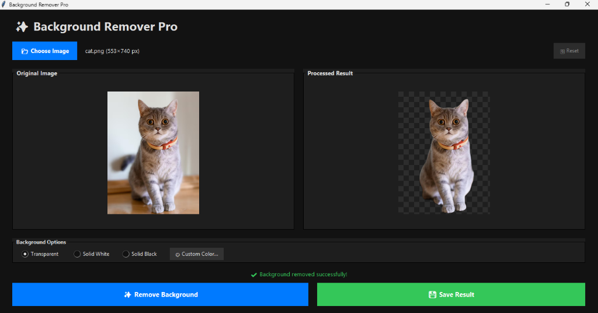
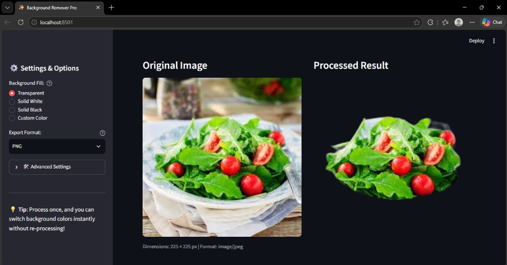

# ✨ Picture Background Remover Pro

An AI-powered offline image background removal tool with both a **Desktop GUI (Tkinter)** and a modern **Web Interface (Streamlit)**. Remove backgrounds or replace them with custom solid colors locally on your machine with high precision.

---

## 📸 Screenshots

### 🖥️ Desktop Application (Tkinter)


### 🌐 Web Application (Streamlit)


---

## 🌟 Key Features

- **⚡ Fast & Offline**: Uses deep-learning ONNX models (`rembg` / `u2net`) that run completely locally on your CPU or GPU without sending your photos to external servers.
- **🖥️ Dual Interfaces**:
  - **Desktop GUI**: Native dark-themed Tkinter desktop application with live checkered transparency preview and instant color replacement.
  - **Web Application**: Interactive Streamlit web interface with fine-tuned edge matting, side-by-side comparison, and one-click download.
- **🎨 Instant Background Replacement**:
  - Transparent (standard alpha cutout)
  - Solid White
  - Solid Black
  - Custom Color (Interactive color picker)
  - *No need to re-run AI model*—once processed, change background colors instantly!
- **🔬 Advanced Edge Matting**: Fine-tune boundary detection for challenging subjects like fine hair, animal fur, or transparent fabrics.
- **💾 Multi-Format Export**: Save directly as **PNG** (transparent), **JPEG** (automatically composited with solid fill), or **WEBP**.
- **📱 Smart Orientation**: Automatically corrects camera and smartphone rotation using EXIF metadata (`ImageOps.exif_transpose`).
- **🛡️ Rock-Solid Stability**: Safe daemon background threading prevents UI freezes and window hang on exit.

---

## 📁 Project Structure

```
picture_background_remover/
├── assets/                     # UI screenshots and visual assets
│   ├── desktop_preview.png     # Tkinter desktop screenshot
│   └── web_preview.png         # Streamlit web interface screenshot
├── core/                       # Shared image processing engine
│   ├── __init__.py
│   └── remover.py              # AI session cache, compositing & export utilities
├── tests/                      # Automated unit tests
│   ├── __init__.py
│   └── test_remover.py         # Test suite for engine & format export
├── main.py                     # Desktop GUI application (Tkinter)
├── app.py                      # Modern web interface (Streamlit)
├── requirements.txt            # Project dependencies
├── run_desktop.bat             # One-click Windows desktop launcher
├── run_web.bat                 # One-click Windows web app launcher
├── .gitignore                  # Git ignore rules
└── README.md                   # Documentation
```

---

## 🚀 Quick Start

### 1. Prerequisites
Ensure you have **Python 3.9+** installed.

### 2. Installation
Clone the repository (or open the project directory) and install the dependencies:

```bash
pip install -r requirements.txt
```

---

## 💻 How to Run

### Option A: Desktop Application (Tkinter)
Run via terminal:
```bash
python main.py
```
*Or double-click `run_desktop.bat` on Windows.*

1. Click **📂 Choose Image** to open your photo.
2. Click **✨ Remove Background** to process.
3. Switch between **Transparent**, **Solid White**, **Solid Black**, or **🎨 Custom Color**.
4. Click **💾 Save Result** to export to PNG, JPG, or WEBP.

---

### Option B: Web Application (Streamlit)
Run via terminal:
```bash
streamlit run app.py
```
*Or double-click `run_web.bat` on Windows.*

1. Open `http://localhost:8501` in your browser.
2. Drag and drop or upload an image.
3. Choose your desired background and output format in the sidebar.
4. Click **⚡ Remove Background**.
5. Click **💾 Download Result** to save the processed image.

---

## 🧪 Running Tests

Run the automated test suite:

```bash
python -m unittest discover -s tests -p "test_*.py" -v
```

---

## 📋 Supported Formats

- **Input**: `.png`, `.jpg`, `.jpeg`, `.webp`, `.bmp`
- **Output**: `.png` (lossless with alpha transparency), `.jpg` (solid background composite), `.webp`

---

## 📄 License

This project is licensed under the MIT License.
